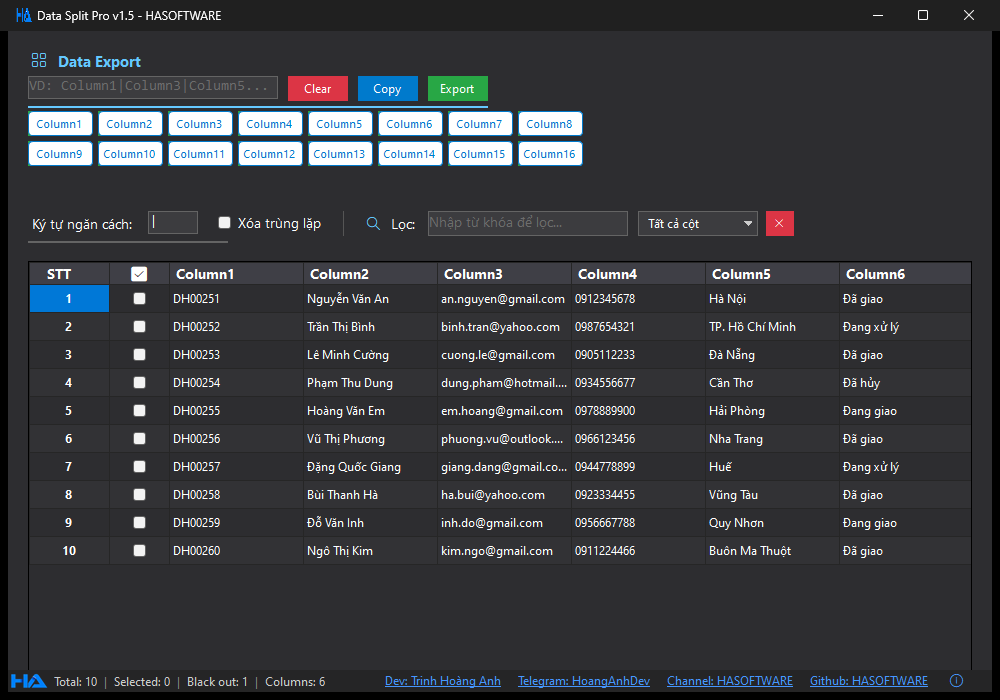
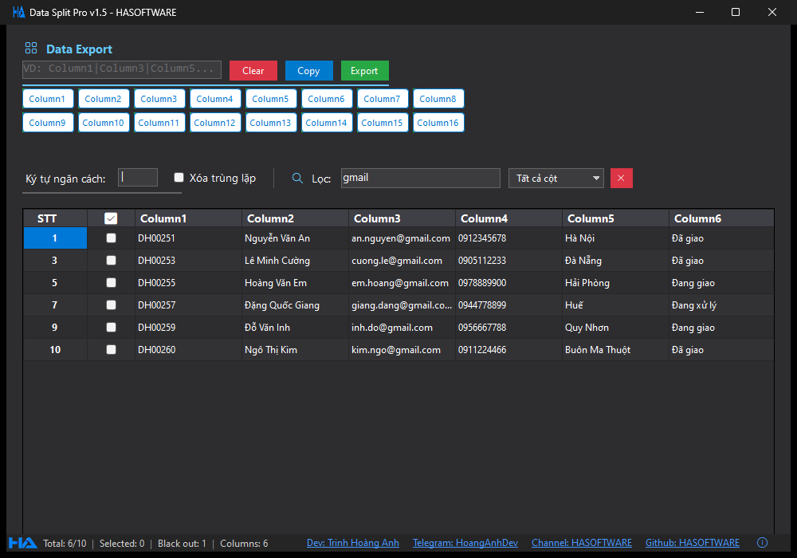
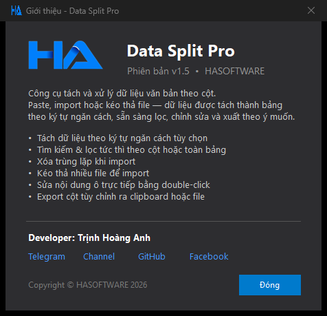

# Data Split Pro

Data Split Pro là công cụ tách và xử lý dữ liệu văn bản theo cột dành cho Windows, phát triển bởi HASOFTWARE. Chỉ cần paste, import hoặc kéo thả file — dữ liệu thô sẽ được tách thành bảng theo ký tự ngăn cách, sẵn sàng để lọc, chỉnh sửa, loại bỏ trùng lặp và xuất ra theo đúng định dạng bạn cần.

## Giao diện

Giao diện chính — dữ liệu được tách thành cột, kèm số thứ tự và ô tích chọn từng dòng:



Tìm kiếm và lọc tức thì — gõ từ khóa là bảng lọc ngay, có thể lọc theo một cột cụ thể hoặc toàn bảng:



Hộp thoại giới thiệu phần mềm (mở bằng phím F1):



## Tính năng

- Tách dữ liệu theo ký tự ngăn cách tùy chọn (mặc định `|`)
- Paste trực tiếp từ clipboard hoặc import từ file, có tùy chọn giữ lại hay xóa dữ liệu cũ
- Kéo thả một hoặc nhiều file vào bảng để import
- Tìm kiếm và lọc tức thì theo từng cột hoặc toàn bảng
- Tùy chọn tự động xóa dòng trùng lặp khi import
- Sửa nội dung ô trực tiếp bằng cách double-click, như bảng tính
- Tích chọn từng dòng, chọn theo vùng bôi đen, xóa dòng theo nhiều điều kiện
- Export các cột tùy chỉnh ra clipboard hoặc file theo định dạng tự đặt
- Phím tắt: Ctrl+A chọn tất cả, Ctrl+C copy, Delete xóa dòng, Space tích chọn, F1 giới thiệu

## Tải về

Tải phiên bản mới nhất tại trang Releases:

**https://github.com/hasoftware/ToolSplitData/releases**

Mỗi phiên bản có 2 lựa chọn:

| File | Dành cho |
| --- | --- |
| `DataSplitPro-vX.Y-Setup.msi` | Bộ cài đặt — cài vào máy, có shortcut Start Menu và Desktop |
| `DataSplitPro-vX.Y-Portable.exe` | Bản chạy ngay — 1 file duy nhất, không cần cài đặt |

Cả hai bản đều đã tích hợp sẵn .NET Runtime, máy bạn **không cần cài .NET hay bất kỳ thư viện nào khác**.

## Cài đặt

### Bản cài đặt (MSI)

1. Tải file `DataSplitPro-vX.Y-Setup.msi` từ trang Releases
2. Chạy file, làm theo hướng dẫn trên màn hình
3. Mở ứng dụng từ shortcut trên Desktop hoặc Start Menu

Khi cài phiên bản mới, bản cũ sẽ tự động được thay thế. Gỡ cài đặt trong Settings > Apps như mọi phần mềm khác.

### Bản Portable

1. Tải file `DataSplitPro-vX.Y-Portable.exe`
2. Double-click để chạy — không cần cài đặt

Lưu ý: vì phần mềm chưa có chữ ký số, lần chạy đầu tiên Windows SmartScreen có thể hiện cảnh báo. Chọn "More info" rồi "Run anyway" để tiếp tục.

## Hướng dẫn sử dụng nhanh

1. Nhập ký tự ngăn cách phù hợp với dữ liệu của bạn (ví dụ `|`, `:`, `;`, `,`)
2. Chuột phải vào bảng, chọn "Paste Data" hoặc "Import Data từ File" — hoặc đơn giản là kéo thả file vào bảng
3. Dữ liệu được tách thành các cột Column1, Column2...
4. Dùng ô "Lọc" để tìm kiếm, tích chọn các dòng cần thiết
5. Ở khung "Data Export", nhập định dạng cột muốn xuất (ví dụ `Column1|Column3`) hoặc bấm các nút Column có sẵn, rồi bấm "Copy" để copy vào clipboard hoặc "Export" để lưu ra file

## Yêu cầu hệ thống

| Thành phần | Yêu cầu |
| --- | --- |
| Hệ điều hành | Windows 10 / Windows 11 (64-bit) |
| .NET Runtime | Không cần — đã tích hợp sẵn |
| Dung lượng | Khoảng 70MB |

## Build từ mã nguồn

Yêu cầu: .NET SDK 6.0 trở lên. Nếu muốn build bộ cài MSI cần thêm WiX Toolset (`dotnet tool install --global wix`).

```
git clone https://github.com/hasoftware/ToolSplitData.git
cd ToolSplitData

# Chạy thử
dotnet run

# Build bản Release
dotnet build -c Release

# Build trọn bộ: bản Portable + bộ cài MSI (kết quả trong thư mục dist)
.\build-installer.ps1
```

## Cộng đồng và hỗ trợ

Tham gia cộng đồng HASOFTWARE trên Telegram để nhận thông báo phiên bản mới, chia sẻ thủ thuật và yêu cầu tính năng:

- Kênh cộng đồng: [t.me/hasoftware](https://t.me/hasoftware)
- Liên hệ developer: [t.me/hoanganhdev](https://t.me/hoanganhdev)

Gặp lỗi hoặc có ý tưởng mới? Tạo [Issue trên GitHub](https://github.com/hasoftware/ToolSplitData/issues) hoặc nhắn trực tiếp qua Telegram.

## Giấy phép

Copyright © HASOFTWARE. All rights reserved.

Phần mềm thuộc sở hữu của HASOFTWARE. Vui lòng không sao chép, phân phối lại hoặc chỉnh sửa khi chưa được cho phép.

---

Developer: Trịnh Hoàng Anh — HASOFTWARE
